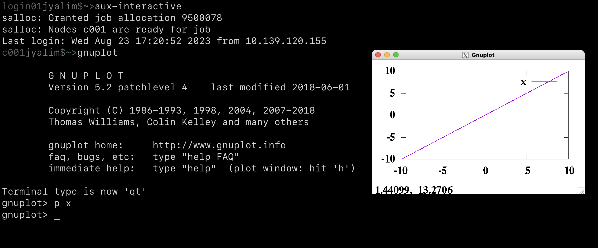
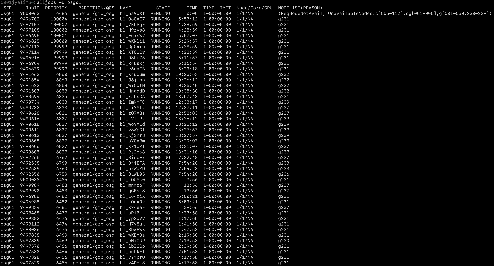
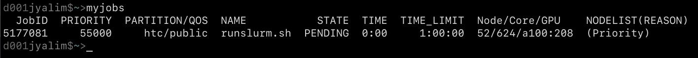
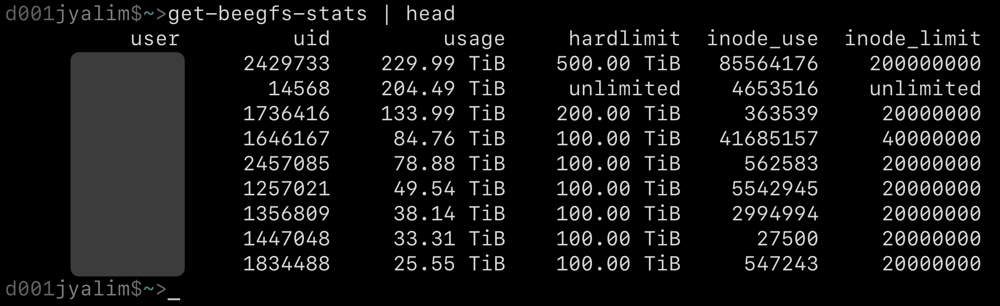
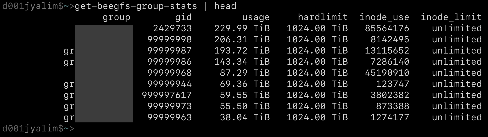
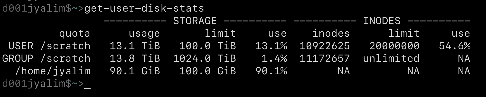

Various scripts for the Sol supercomputer
=========================================

The scripts are available in `./bin/`. See the rest of our public Sol
stack and information about the Sol supercomputer by visiting our
official [Sol github repository][sol-repo].

For details on `mkjupy`, which is utilized by Sol's users to setup
conda/mamba python environments for use with Jupyter (installs ipykernel
if needed, then creates the appropriate kernel JSON in
`~/.local/share/jupyter/kernels`), see 
[our `mkjupy` documentation][mkjupy].

Otherwise, screenshots of the various utilities are provided below with
short descriptions.

`aux-interactive`
-----------------

This is a wrapper around `salloc`, that connects the calling user to
Sol's oversubscribed and highly-available 'lightwork' partition. This is
especially useful for students that are first learning how to use the
supercomputer. The connection script allows X11 forwarding, and will
accept typical `salloc` flags that will override its default behavior.
Once the `ssh` session is closed (or if the script encounters errors),
the script will cancel the allocated job.

 
 
  
 

`alljobs`
---------

This is a wrapper around `squeue` that prints out all the system's jobs.
It also takes regular `squeue` flags that will modify its behavior
accordingly. It is related to the provided `myjobs` utility, except it
is not pinned to a single user (which defaults to the calling user) or a
comma-separated list of users.

 
 
  
 

`myjobs`
--------

This is a wrapper around `squeue` that, by default, prints out the
calling user's jobs.  It also takes regular `squeue` flags that will
modify its behavior accordingly. It is related to the provided `alljobs`
utility, except it is pinned to a single user or a comma-separated list
of users.

 
 
  
 

`get-beegfs-stats`
------------------

This is a wrapper around `beegfs-ctl` that prints out the BeeGFS
(scratch) quotas for all users. In the screenshot example below,
usernames are redacted.

 
 
  
 

`get-beegfs-group-stats`
------------------------

This is a wrapper around `beegfs-ctl` that prints out the BeeGFS
(scratch) quotas for all groups. In the screenshot example below, group
names are redacted.

 
 
  
 

`get-user-disk-stats`
------------------------

This prints out a summary of system BeeGFS (scratch) utilization for the
calling user and their group, as well as utilization of the calling
user's home directory. The script optionally takes `uid` and `gid` as
positional arguments, making it a helpful tool for system administrators
as well. This script is called when users log in. 

 
 
  
 

[mkjupy]: https://asurc.atlassian.net/wiki/spaces/RC/pages/1695285256/Jupyter+kernels+on+Sol
[sol-repo]: https://github.com/asu-ke/sol
